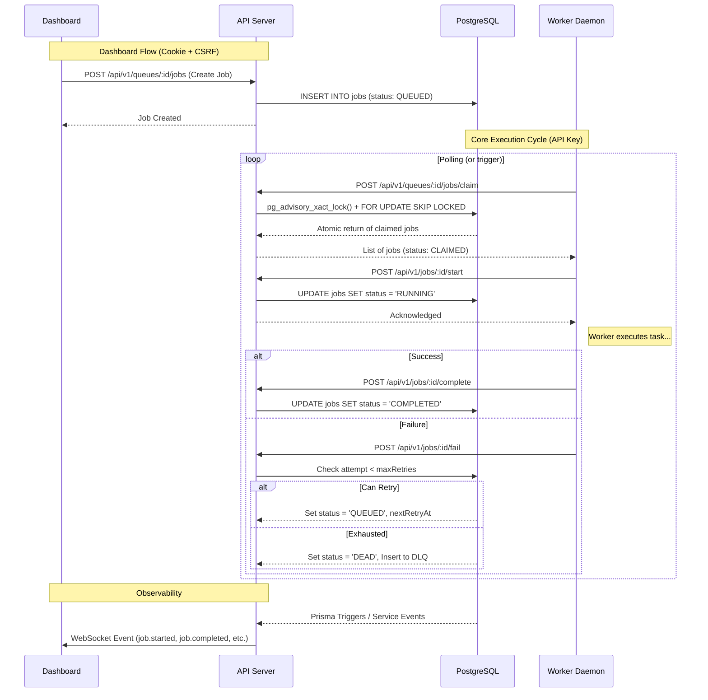
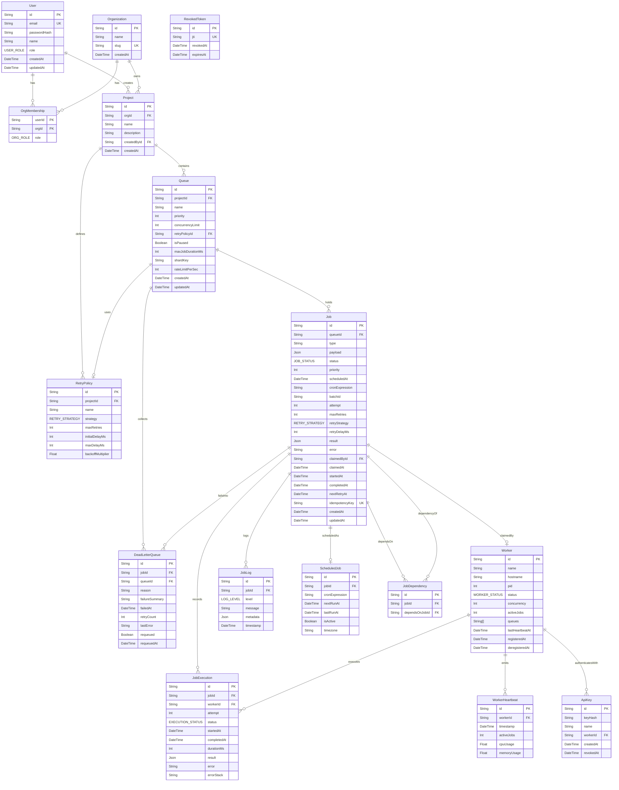

# Distributed Job Scheduler

A robust, multi-tenant distributed job scheduling platform designed for fault tolerance and high concurrency. The system coordinates atomic job claiming via advisory locks, enforces resilient state transitions, supports configurable exponential backoff and jitter for retries, and maintains a strict Dead Letter Queue (DLQ) for exhausted jobs. It ships with a real-time WebSocket dashboard for observability and control, alongside a horizontally scalable worker daemon.


---

## Architecture Flow

The traffic is cleanly partitioned: **Workers** interact exclusively with internal claim/state APIs via cryptographically hashed API keys, while **Dashboard users** authenticate via secure `httpOnly` cookies protected by strict CSRF middleware.



## Key Features

### Job Lifecycle & Reliability
- **Atomic Claiming:** Prevents race conditions during high-concurrency claiming using Postgres transaction-level advisory locks combined with `FOR UPDATE SKIP LOCKED`.
- **Idempotent State Machine:** Enforces strict directional state transitions (`QUEUED` → `CLAIMED` → `RUNNING` → `COMPLETED`/`FAILED`/`DEAD`), rejecting out-of-order execution attempts.
- **Resilient Retries:** Configurable per-queue retry policies featuring linear or exponential backoff, automatically jittered to prevent thundering herd problems.
- **Dead Letter Queue (DLQ):** Automatically cascades chronically failing jobs into a traceable DLQ, preventing bad tasks from poisoning queues infinitely.

### Auth & Security
- **Hardened User Auth:** JWTs stored securely in `httpOnly` cookies with strict SameSite policies, accompanied by mandatory Origin/Referer CSRF validation for all dashboard traffic.
- **API Key Segregation:** Worker traffic bypasses generic middlewares, verifying securely hashed API keys with `crypto.timingSafeEqual` to thwart timing attacks.
- **Role-Based Access Control:** Explicit org-level and project-level ownership checks preventing unauthorized cross-tenant job mutation or queue manipulation.
- **Token Rotation & Revocation:** Built-in JWT revocation tracking using `jti` to immediately invalidate compromised sessions.

### Observability
- **Worker Heartbeats:** Granular tracking of worker health, CPU/memory usage, and active job concurrency.
- **Execution Logging:** Per-job execution tracing and granular event logging stored directly alongside the job history.
- **Real-Time Dashboards:** End-to-end WebSocket integration broadcasting state mutations directly to scoped project channels.

---

## Entity-Relationship Diagram



---

## Getting Started

### Prerequisites
- Node.js >= 18
- PostgreSQL 15+ (if running locally)
- Docker & Docker Compose (optional but recommended)

### Quick Start (Docker Compose)

The easiest way to boot the full stack is via Docker.

1. **Configure Environment:**
   ```bash
   cp .env.example .env
   ```

2. **Boot the Database:**
   ```bash
   docker-compose up -d postgres
   ```

3. **Migrate and Seed:**
   Run migrations and seed the database to generate your default organization, project, admin user, and the worker API key.
   ```bash
   npm run db:migrate -w packages/api
   npm run db:seed -w packages/api
   ```
   > [!IMPORTANT]
   > The seed script will print a generated `WORKER_API_KEY` to your console. Copy this value and add it to your `.env` file under `WORKER_API_KEY=...`

4. **Boot the Stack:**
   ```bash
   docker-compose up --build
   ```
   - **Dashboard:** `http://localhost:8080` (Log in with `admin@codity.local` / `Admin123!`)
   - **API:** `http://localhost:3000`

### Local Development (Manual)

If you prefer to run services natively:

1. Copy `.env.example` to `.env`. Ensure your local PostgreSQL is running and update `DATABASE_URL` if needed.
2. Install dependencies:
   ```bash
   npm install
   ```
3. Initialize the database:
   ```bash
   npm run db:migrate -w packages/api
   npm run db:seed -w packages/api
   ```
4. Update `.env` with the generated `WORKER_API_KEY`.
5. Run the services in separate terminals:
   - **API Server:** `npm run dev -w packages/api`
   - **Worker Daemon:** `npm run dev -w packages/worker`
   - **Dashboard:** `npm run dev -w packages/dashboard`

---

## Project Structure

This is a monolithic monorepo structured via NPM workspaces:

- `packages/api` — Express.js server, Prisma ORM, Socket.io server, and core business logic.
- `packages/worker` — Standalone Node.js daemon that connects to the API via securely hashed API keys, polling queues and executing jobs.
- `packages/dashboard` — React + Vite SPA using TailwindCSS, Zustand for state, and Recharts for visualization.

---

## API Reference & Usage

For full architectural context and reasoning on design decisions (like why advisory locks were chosen over pure row-locks), see [ARCHITECTURE.md](./ARCHITECTURE.md).

### Example: Core Lifecycle Execution

**1. Create a Job**
```bash
curl -X POST http://localhost:3000/api/v1/queues/<QUEUE_ID>/jobs \
  -H "Cookie: accessToken=<YOUR_JWT>" \
  -H "Content-Type: application/json" \
  -d '{"type": "video_encode", "payload": {"file": "vid.mp4"}}'
```

**2. Claim the Job (Worker Only)**
```bash
curl -X POST http://localhost:3000/api/v1/queues/<QUEUE_ID>/jobs/claim \
  -H "Authorization: Bearer <YOUR_WORKER_API_KEY>" \
  -H "Content-Type: application/json" \
  -d '{"limit": 1}'
```

**3. Complete the Job (Worker Only)**
```bash
curl -X POST http://localhost:3000/api/v1/jobs/<JOB_ID>/complete \
  -H "Authorization: Bearer <YOUR_WORKER_API_KEY>" \
  -H "Content-Type: application/json" \
  -d '{"result": {"status": "success"}, "durationMs": 1200}'
```

---

## Testing

The API package includes a robust integration testing suite ensuring the resilience of the state machine.
Run tests via:
```bash
npm run test -w packages/api
```

The suite covers:
- **Idempotency:** Re-claiming or double-completing jobs fails gracefully.
- **RBAC:** Cross-tenant ownership checks explicitly reject unauthorized pause, resume, cancel, or retry attempts.
- **Queue Pausing:** Validates that paused queues do not yield jobs to workers during `SKIP LOCKED` queries.
- **DLQ Exhaustion:** Confirms that jobs strictly transition to `DEAD` after exceeding their queue's configured maximum retries.

---

## Known Limitations / Roadmap

- **Stale `RUNNING` Job Reaper:** If a worker hard-crashes mid-execution, the job is left stranded in the `RUNNING` state. A heartbeat-based reaper sweep is planned but not yet implemented.
- **Distributed Concurrency Enforcement:** Queue concurrency limits (`concurrencyLimit`) currently operate strictly per-worker-process. Global cross-worker concurrency limiting requires a centralized mechanism (e.g., Redis).
- **Telemetry Export:** No OpenTelemetry or Prometheus integration is currently active. Observability relies entirely on the WebSocket dashboard and PostgreSQL-backed job logs.
