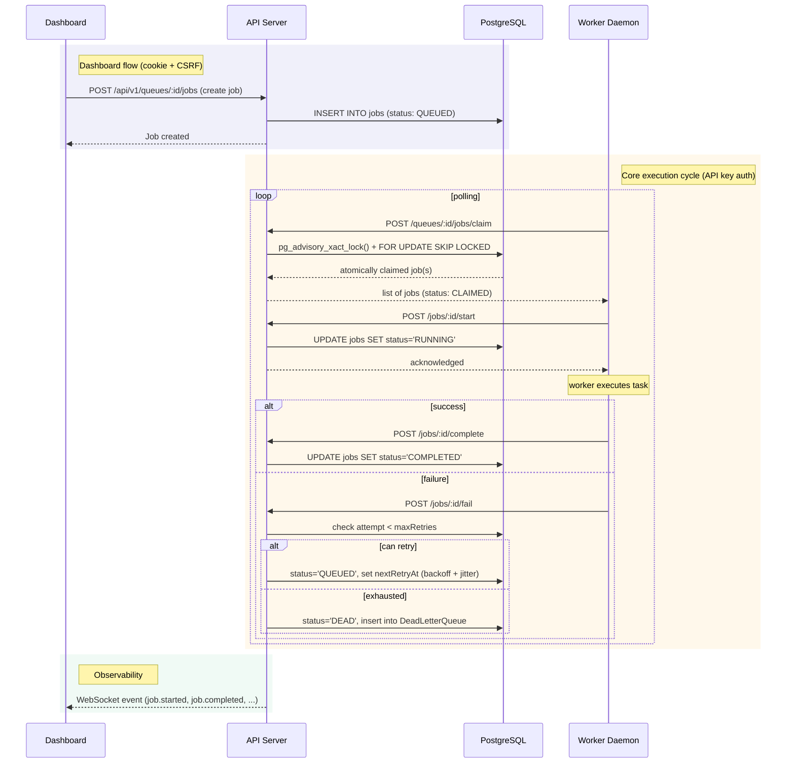
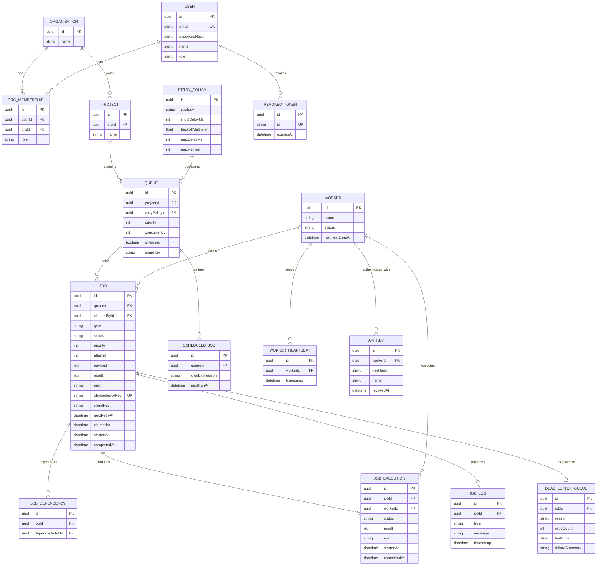

# Distributed Job Scheduler

A distributed job scheduling platform with authenticated multi-project queues, atomic worker claiming, configurable retries with a Dead Letter Queue, and a live monitoring dashboard.

**Stack:** Node.js / Express / Prisma / PostgreSQL / React (Vite) / Socket.IO

---

## Live Deployment

| | |
|---|---|
| **Dashboard** | [distributed-job-scheduler-dashboard.vercel.app](https://distributed-job-scheduler-dashboard.vercel.app) (Vercel) |
| **API** | [codity-backend.onrender.com](https://codity-backend.onrender.com) (Render) |
| **Repository** | [github.com/Ssr446/distributed-job-scheduler](https://github.com/Ssr446/distributed-job-scheduler) |

> An external uptime monitor (UptimeRobot) periodically pings the API to reduce Render's free-tier idle spin-down during evaluation. An occasional cold start (~30-60s) is still possible if a ping is missed.

Not sure where to start? See [Getting Started](#getting-started) below, or jump straight to [ARCHITECTURE.md](./ARCHITECTURE.md) for the design reasoning behind the core execution path.

---

## Architecture

The system is a three-package monorepo: an API server (Express + Prisma), a standalone worker process, and a React dashboard. The worker is not a library imported into the API — it's an independent HTTP client authenticated with its own service-account API key, distinct from the cookie-based JWT authentication used by the dashboard. This separation means the worker can, in principle, be scaled horizontally as an independent deployable unit without any change to the API.



### Authentication boundary

Two independent authentication schemes are deliberately kept separate rather than sharing one JWT-based path:

- **Dashboard users** authenticate via httpOnly, Secure cookies (JWT access + refresh, rotation-on-use, DB-backed revocation by JTI), protected against CSRF via Origin/Referer validation.
- **Workers** authenticate via a separate API-key mechanism (SHA-256 hashed, constant-time compared), routed so worker-facing endpoints never pass through the cookie/CSRF middleware chain at all.

See [ARCHITECTURE.md](./ARCHITECTURE.md) for why this split exists and the tradeoffs involved.

---

## Database Design

16 models in PostgreSQL via Prisma: `User`, `Organization`, `OrgMembership`, `Project`, `Queue`, `RetryPolicy`, `Job`, `JobExecution`, `JobLog`, `JobDependency`, `ScheduledJob`, `Worker`, `WorkerHeartbeat`, `DeadLetterQueue`, `ApiKey`, `RevokedToken`.



Key design choices, performance notes, and the full reasoning behind schema decisions are in [ARCHITECTURE.md](./ARCHITECTURE.md).

---

## Features

**Job Lifecycle & Reliability**
- Atomic claiming via PostgreSQL advisory locks + `FOR UPDATE SKIP LOCKED`
- Idempotent claim → start → complete/fail state machine (safe against duplicate/retried HTTP calls)
- Configurable retry strategies — fixed, linear, exponential — with jitter
- Dead Letter Queue with pattern-matched failure categorization and dependency cascading
- Graceful shutdown; in-flight jobs are drained, not dropped

**Auth & Security**
- httpOnly, Secure cookies for dashboard sessions; SameSite policy adapts to deployment topology
- Separate service-account API-key auth for workers, structurally isolated from user auth
- CSRF protection via Origin/Referer validation
- DB-backed JWT revocation with refresh-token rotation-on-use
- Role-based access control (global + per-organization)

**Observability**
- Per-job execution logs and retry history
- Worker heartbeats
- Real-time WebSocket updates (project-scoped rooms, JWT-authenticated handshake)
- Metrics dashboard (throughput, latency, status distribution)

**Bonus**
- Workflow/job dependencies with automatic resolution and cascade
- Rate limiting (separate tiers for login, general API, worker polling)
- Queue sharding via `shardKey`
- Event-driven internal architecture decoupling state changes from broadcasts

---

## Getting Started

### Prerequisites
- Node.js
- PostgreSQL
- npm

### Local setup

```bash
# 1. Install dependencies (npm workspaces monorepo)
npm install

# 2. Configure environment
cp .env.example .env
# fill in DATABASE_URL, JWT_SECRET, JWT_REFRESH_SECRET, CORS_ORIGIN, FRONTEND_URL

# 3. Migrate and seed
npm run db:migrate -w packages/api
npm run db:seed -w packages/api
# the seed script prints a worker API key — copy it into WORKER_API_KEY in .env

# 4. Run each package (separate terminals)
npm run dev -w packages/api
npm run dev -w packages/worker
npm run dev -w packages/dashboard
```

### Or with Docker

```bash
cp .env.example .env
docker-compose up --build
```

### Logging in

Use the credentials printed by the seed script (default: `admin@scheduler.io` / `password123`) at `http://localhost:5173` (or the Vercel URL above for the live deployment).

---

## Project Structure

```
packages/
  api/         Express + Prisma REST API — auth, orgs/projects/queues/jobs, DLQ, metrics
  worker/      Standalone HTTP client — polls, claims, executes, reports outcomes
  dashboard/   React (Vite) SPA — monitoring, queue management, real-time updates
```

---

## API Reference

Full endpoint reference is in [ARCHITECTURE.md](./ARCHITECTURE.md). Representative examples:

```bash
# Create a job (immediate, delayed via scheduledAt, recurring via cronExpression,
# or dependent via dependsOn)
curl -X POST https://codity-backend.onrender.com/api/v1/queues/:queueId/jobs \
  -H "Content-Type: application/json" --cookie "accessToken=..." \
  -d '{ "type": "charge_card", "payload": { "amount": 500 } }'

# Worker: atomic claim (API-key auth)
curl -X POST https://codity-backend.onrender.com/api/v1/queues/:queueId/jobs/claim \
  -H "Authorization: Bearer <workerId>.<secret>"

# Worker: report completion (API-key auth)
curl -X POST https://codity-backend.onrender.com/api/v1/jobs/:id/complete \
  -H "Authorization: Bearer <workerId>.<secret>" \
  -H "Content-Type: application/json" -d '{ "durationMs": 120 }'
```

---

## Testing

```bash
npm run test -w packages/api
```

Covers authentication, job lifecycle, the full worker execution path end to end (claim → start → complete/fail → retry → exhaust → DEAD, with exact row-count assertions on `JobExecution` and `DeadLetterQueue`), queue pause/resume, and cross-organization authorization checks.

---

## Design Decisions

See [ARCHITECTURE.md](./ARCHITECTURE.md) for the reasoning behind:
- Advisory locks over an external queue broker
- Idempotent state transitions via conditional updates
- Splitting dashboard and worker authentication into structurally separate paths
- Deployment-topology-dependent cookie policy

---

## Known Limitations

Documented explicitly rather than omitted:

- No stale-job reaper yet — a worker crash between claim and outcome-report leaves a job in `RUNNING` with no automatic watchdog.
- No cross-worker global concurrency enforcement beyond what the queue-level claim query naturally serializes.
- No Prometheus-style metrics export or distributed tracing.
- Job Explorer's list updates via manual refresh rather than reacting live to WebSocket events (toast notifications elsewhere are real-time).
- Mobile responsiveness implemented and lightly tested, not exhaustively audited.
- The live deployment's free-tier Postgres instance is subject to Render's retention window; the bundled worker/API process is a cost-driven accommodation for Render's free tier, not the target production topology (in a paid/self-hosted deployment they'd run as fully independent services, which the code already supports).

---

## License

Submitted as part of an internship assignment.

