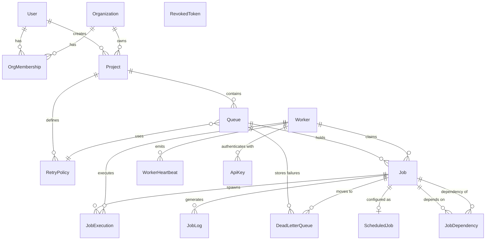

# Codity - Distributed Job Scheduler

A production-grade distributed job scheduling platform with guaranteed exactly-once delivery, idempotent worker execution, real-time WebSocket monitoring, and robust failure cascades.

## System Overview
Codity splits into three primary components within a monorepo:
- **API (`packages/api`)**: The core orchestrator. Exposes REST endpoints, maintains the WebSocket state for the dashboard, manages authentication, and strictly controls queue concurrency using PostgreSQL advisory locks.
- **Worker (`packages/worker`)**: The standalone execution daemon. It polls the API via HTTP, claims jobs, executes them, and reports back success/failure.
- **Dashboard (`packages/dashboard`)**: The web UI for managing queues, tracking throughput metrics, and viewing real-time job execution logs.

## Architecture

```mermaid
graph TD
    Dashboard["🖥️ Dashboard (React)"] <-->|REST + WebSocket| API["⚙️ API Server (Express)"]
    API <-->|Prisma ORM| Postgres[("🐘 PostgreSQL")]
    
    Worker1["👷 Worker Node 1"] <-->|REST (API Key)| API
    Worker2["👷 Worker Node 2"] <-->|REST (API Key)| API
    
    subgraph "Job State Flow"
        Claim["1. Claim Job<br/>(Advisory Lock)"] --> Start["2. Start Job"]
        Start --> Complete["3a. Complete"]
        Start --> Fail["3b. Fail (Retry or DLQ)"]
    end
    
    Worker1 -.->|Executes| Claim
```

### Entity-Relationship Diagram


## Setup & Prerequisites
1. **Node.js** (v20+) and **npm**
2. **PostgreSQL** (v15+) or Docker

### Local Environment Setup
1. Copy the example `.env` file:
   ```bash
   cp .env.example .env
   ```
2. Install dependencies across all packages:
   ```bash
   npm install
   ```

### Database Initialization
1. Spin up a local PostgreSQL instance (or use the one in `docker-compose`).
2. Run Prisma migrations:
   ```bash
   npm run db:migrate
   ```
3. Seed the database with the initial setup:
   ```bash
   npm run db:seed
   ```
   > **IMPORTANT**: The seed script will print a generated `WORKER_API_KEY`. Copy this value and add it to your `.env` file under `WORKER_API_KEY=...` so the worker can authenticate.

## Running the Application

### Option A: Local Development
Run all three services (API, Worker, Dashboard) concurrently in watch mode:
```bash
npm run dev
```
- Dashboard: `http://localhost:5173`
- API: `http://localhost:3000/api/v1`

### Option B: Docker Compose (Production Build)
Build and run the entire stack (Postgres + API + Worker + Nginx Dashboard) using Docker:
```bash
# Ensure your .env file has WORKER_API_KEY set from the seed output!
docker-compose up --build
```
- Dashboard will be available at `http://localhost:8080`.
