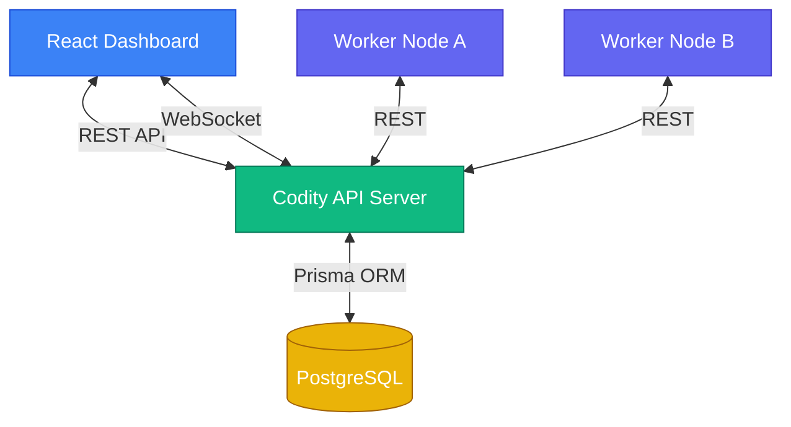

# Codity
A highly scalable, distributed job scheduling system designed for real-time orchestration and execution of background jobs, delayed tasks, and cron schedules.

## Architecture
Codity is built with a Node.js API backend, a PostgreSQL relational database for state storage, and a React + Vite dashboard for real-time monitoring and management.

## Features
- **Job Orchestration**: Execute immediate, delayed, and scheduled/recurring (cron) jobs.
- **Workflow Dependency Resolution**: Run complex DAGs of jobs where jobs wait in `WAITING` status until dependencies complete.
- **Transactional Consistency**: Atomic job claiming and batch creation using PostgreSQL `SELECT ... FOR UPDATE SKIP LOCKED` and Prisma transactions.
- **Distributed Locking**: Guaranteed safety for concurrent workers via Postgres advisory locks.
- **Real-time Monitoring**: WebSocket server feeds the React dashboard live updates of job events and queue throughput.
- **Industry-Grade Security**: JWT authentication with refresh token rotation, strict CORS, rate limiting, and robust payload validation.

## Quick Start
1. Clone the repository.
2. Ensure you have Node.js 18+ and PostgreSQL installed.
3. Copy `.env.example` to `packages/api/.env` and update the database URL.
4. Run `npm install` in both `packages/api` and `packages/dashboard`.
5. Run `npx prisma migrate dev` and `npm run seed` in `packages/api`.
6. Start both servers:
   - API: `npm run dev` in `packages/api`
   - UI: `npm run dev` in `packages/dashboard`

## Docker Deployment
Alternatively, use `docker-compose up -d` to spin up the API, Dashboard, and PostgreSQL database seamlessly.
