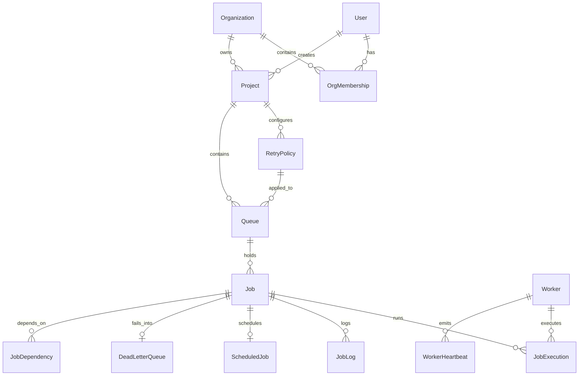

# Entity-Relationship Diagram

```mermaid
erDiagram
    User ||--o{ OrgMembership : has
    Organization ||--o{ OrgMembership : contains
    Organization ||--o{ Project : owns
    User ||--o{ Project : creates
    
    Project ||--o{ RetryPolicy : configures
    Project ||--o{ Queue : contains
    RetryPolicy ||--o{ Queue : applied_to
    
    Queue ||--o{ Job : holds
    Job ||--o{ JobExecution : runs
    Job ||--o{ JobLog : logs
    Job ||--o| ScheduledJob : schedules
    Job ||--o| DeadLetterQueue : fails_into
    Job ||--o{ JobDependency : depends_on
    
    Worker ||--o{ JobExecution : executes
    Worker ||--o{ WorkerHeartbeat : emits
```
